# Module 1: Defender Cloud Security Posture Management 

## Overview
 
A hypothetical organization, "Acme Inc." had a robust cybersecurity infrastructure in place. However, one day, an attacker used a brute force or password spraying attack to gain access to an Internet-exposed server of the organization. 

The attacker could quickly move laterally through the network, exploiting vulnerabilities on the Internet-exposed servers and gaining access to the organization's Storage Accounts, SQL servers, and Key Vaults. The SOC department was alerted by Defender for Cloud on the “Brute Force, Password Spray” IOC/IOA, and quickly realized something was wrong when they noticed unusual activity on the servers and Storage Accounts. 

In response to the attack, the security engineers leveraged the attack path analysis to identify the entry point of the attack and the path the attackers used to move laterally through the network. Based on this analysis, they were able to close the entry point and cut off the attackers' access to the organization's data. 

However, the IT department didn't stop there. They also took a proactive approach by implementing security recommendations to fix the vulnerabilities on the Internet-exposed servers and prevent similar attacks in the future. They also implemented a robust incident response plan and conducted regular security training for employees to educate them on how to identify and avoid brute force and password spraying attacks. 

Thanks to the combination of both reactive and proactive measures, Acme Inc was able to prevent a major data breach and keep their sensitive information safe. This hypothetical use case demonstrates the importance of having both a reactive and proactive approach when it comes to cybersecurity, including performing attack path and security risk analysis, implementing security recommendations, assigning/managing change actions to the proper owners, and educating employees to prevent future attacks.  

Next exercise will show how to leverage the Attack Path feature of Defender for CSPM. 

## Exercise 1: Enabling Defender CSPM plan

In this exercise, you will learn how to enable Defender for CSPM, and leverage Defender for CSPM Capabilities

   >**Note:** To gain access to the capabilities provided by Defender CSPM, you'll need to <a href="https://learn.microsoft.com/en-us/azure/defender-for-cloud/enable-enhanced-security">enable the Defender Cloud Security Posture Management (CSPM) plan </a> on your subscription

1. In **Azure Portal**, search for **Microsoft Defender for Cloud (1)** and then click on it from the search results **(2)**. 

      

2. From **Defender for Cloud** menu, click on **Environment Settings (1)** page and select your subscription **(2)**.

      

3. In the **Defender plans** page, select **Defender CSPM** turn the status to **ON (1)** and select **Settings & monitoring (2)**.

      

4. Turn **ON (1)** the **Agentless scanning for machines (preview)** and click **Continue (2)**.

      

5. Click on **Save** to save the changes. 

   >**Note:** Agentless scanning for VMs provides vulnerability assessment and software inventory in 24 hours. Leave the setup and comeback after 24 hours.

      

## Exercise 2: Explore Attack Paths in your Environment

1. From **Defender for Cloud** menu, open the **Recommendations (1)** page.	You will find Attack path tab as below, click on **Attack path (2)**. You will find the Attack Paths in your Environment. 

      

2.	Click on **Attack path**. You will find the Attack Paths in your Environment. 

3.	Click on **“Internet exposed VM has High severity vulnerabilities and read permission to key vault”**

      
 
4.	You can observe the Attack path and the resources involved in the attack path.

5.	Remediate the recommendations to resolve the attack path 

6.	Explore the rest of the Attack paths found in your Environment and remidiate

## Exercise 3: Build query with Cloud Security Explorer

1. From **Defender for Cloud** menu, open the **Cloud Security Explorer** page.

     
    
2. Select a predefined query Template **“Internet exposed VMs with high severity vulnerabilities” (1)** and click on **Search (2)**.

      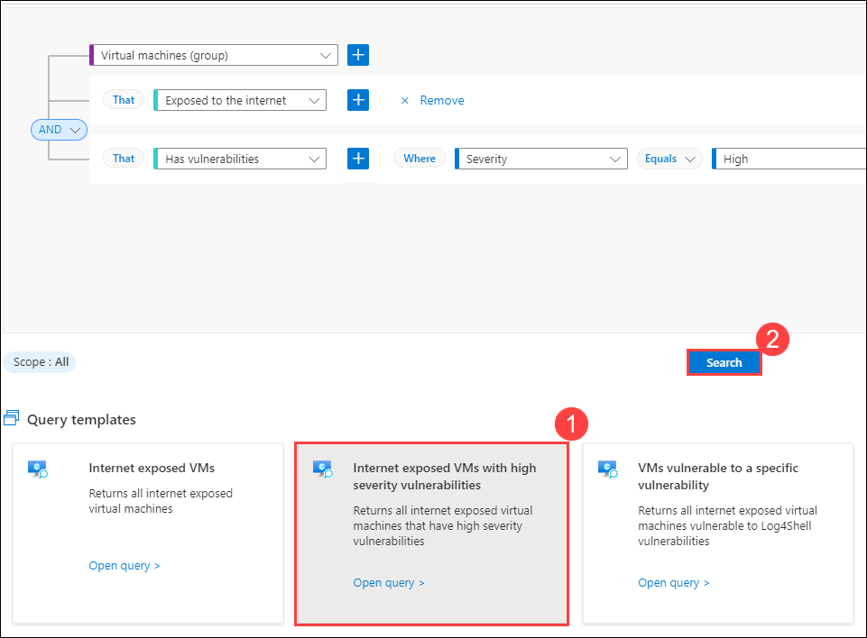

3. You will find the list of VMs with high severity Vulnerabilities.

4. Select a predefined query Template **“Internet exposed SQL servers with managed identity”** and click on **Search**.

      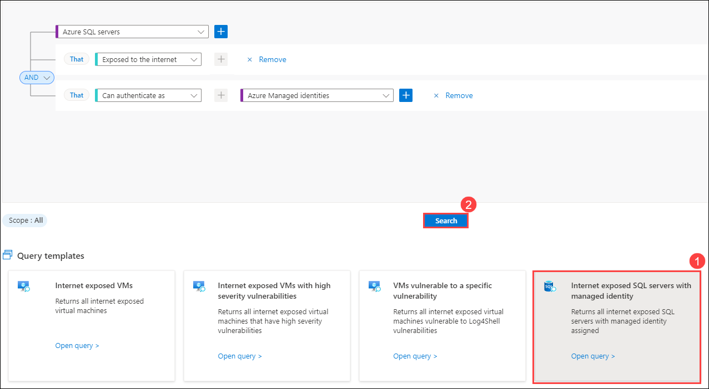

5. You will find the list of SQL servers with managed identity.

6. You can also explore and build your own queries using query builder, from the dropdown select **Compute (1)** -> **Virtual machines (2)** -> **Azure Virtual Machines (3)** then click **Done (4)**.

      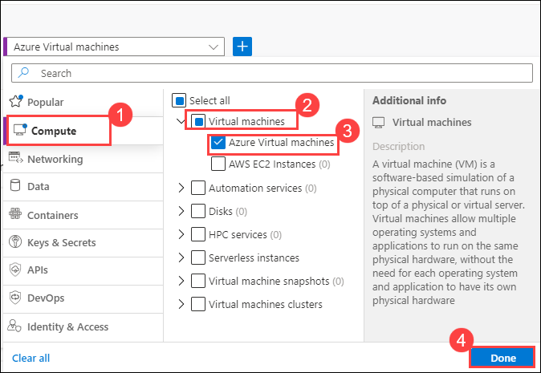

   
 - Click on **+ (1)** and under select condition, select **Security (2)** -> **vulnerable to remote code execution (3)**.

      
      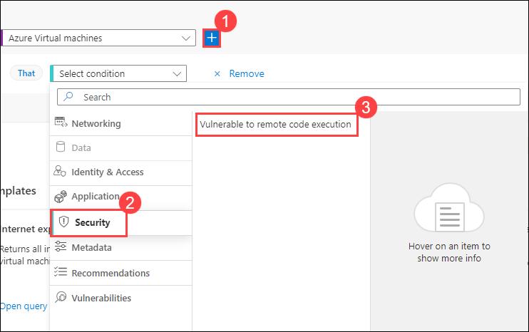

7. Explore your Environment for Virtual Machines with a specific vulnerability. Click on **Vulnerabilities (1)** and select **By CVE ID (2)**.

      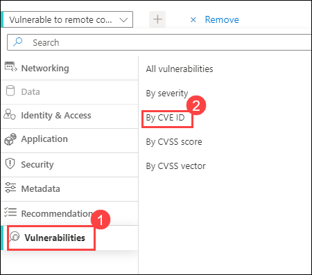
 
 - Search for Virtual Machines that has a specific Vulnerability.
 
      
      

8. Explore your Environment for Storage Accounts exposed to the Internet. From the drop-down click on **Data (1)** then select **Object storage (2)** and choose **Azure storage accounts (3)** from the list and click **Done (4)**.

      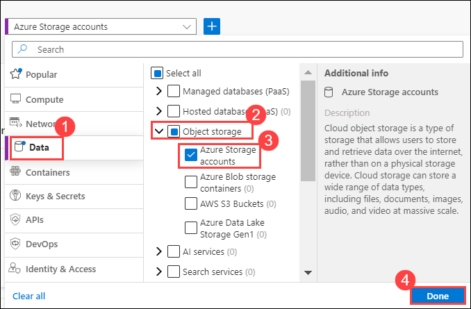

  - Click on **+ (1)** next to **Azure storage accounts**, then from the **Select condition** drop-down menu click on **Netowrking (2)** and select **Exposed to the internet (3)** and click **Search** . 

      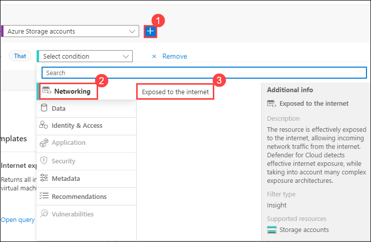

9. Explore your Environment for Storage Accounts with a Sensitive Data. Change the condition to **Data (1)** and click on **Contains sensitive data (2)**.

      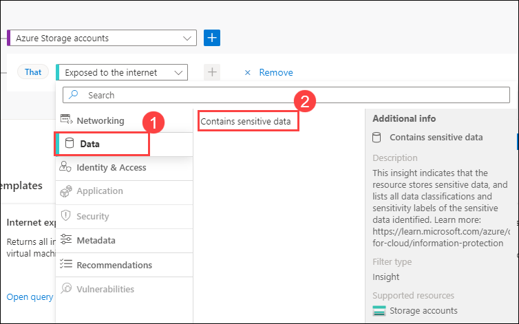

## Exercise 4: Assign Governance Rule

1. From **Defender for Cloud** menu, click on **Environment Settings (1)** page and select your subscription **(2)**.

    

2. Under **Policy settings** Select **Governance Rules (1)** and click on **Enter the new experience (2)**.

    

3. Click on **+ Create governance rule**.

    

4. Enter **Rule name** as `CNAPP-Rule` **(1)**, select **Scope** at subscription level **(2)** and **Priority** `100` **(3)**. Click **Next (4)**.

    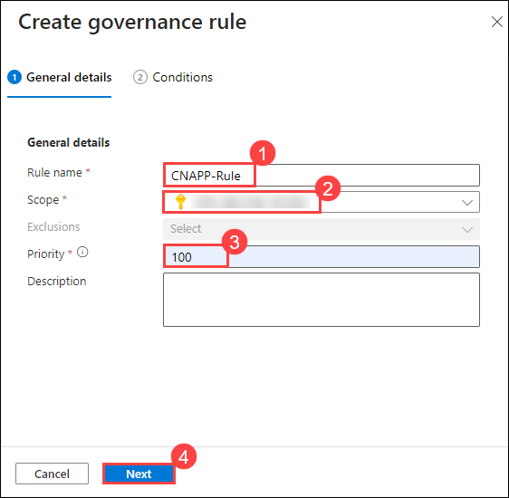
    
5. Under **conditions** provide the below details and click **Create (5)**
	
   - **By severity**: `High` **(1)**
   - **Owner**: `By email address` **(2)**
   - **Email address**: <inject key="AzureAdUserEmail"></inject> **(3)**
   - **Remediation timeframe**: `90 days` **(4)**

    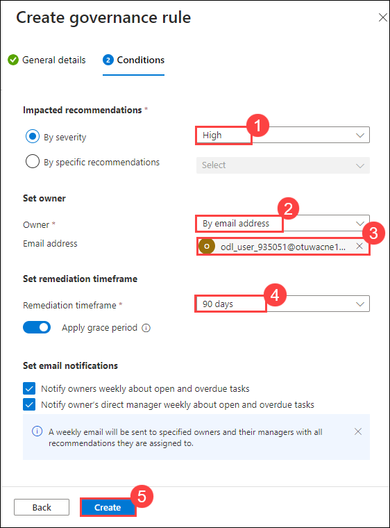

6. Click on **Governance report** to view the status of tasks **Complete, Ontime and Unassign**

    
    
    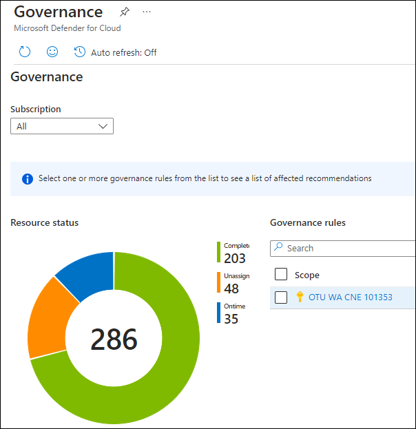
