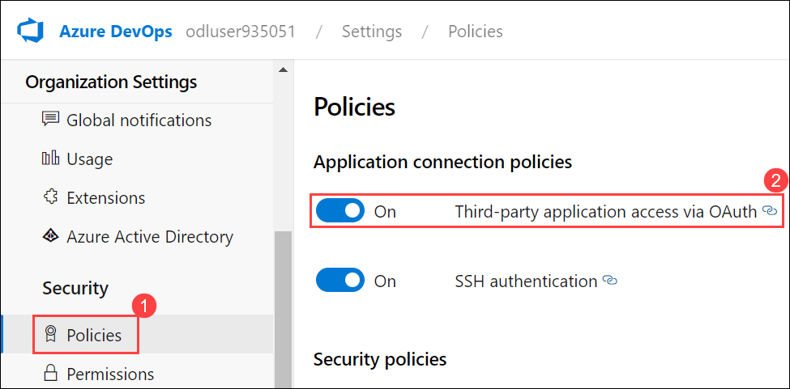
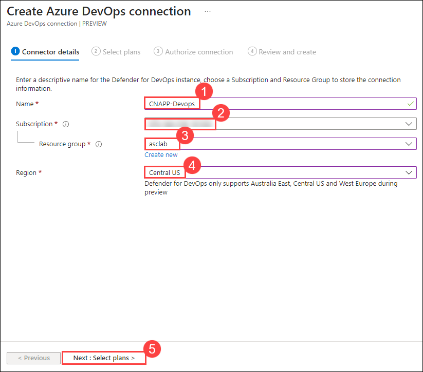
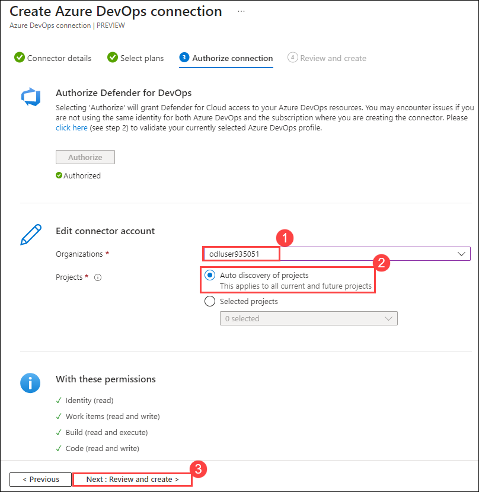

# Module 3 – Configuring Azure ADO Connector in Defender for DevOps


## Objectives
In this exercise, you will learn how to configure Azure ADO Connector in Defender for DevOps.


### Exercise 1: Configuring Azure ADO Connector

1. Navigate to https://dev.azure.com and login using the following credentials:

    * Email: <inject key="AzureAdUserEmail"></inject>
    * Password: <inject key="AzureAdUserPassword"></inject>

2. Click on **Organization settings**. 

    

3. Next, select **Policies (1)** under **Security** and set the toggle button next to **Third-party application access via OAuth** to **On (2)**.

    

4. In the **Azure Portal**, navigate to **Microsoft Defender for Cloud**. Click on **Environment Settings (1)** click the **Add environment (2)** button and click **Azure DevOps (preview) (3)** option. 

    

5. Enter the **Name** for the connector `CNAPP-Devops` **(1)**, select your **Subscription (2)**, select **asclab (3)** resource group, select any **Region (3)**. Select **Next : Select plans > (5)**.

    

6. In the next page leave the default selection with **DevOps** selected and click **Next: Authorize connection >** button to continue. 

    

7. Click **Authorize** button. If this is the first time you’re authorizing your DevOps connection, you’ll receive a pop-up screen, that will ask your permission to authorize. Scroll down the popped up window screen and click the **Accept** button as shown in the sample below:

    

    

> **Note**: When you click **Accept** in your Azure DevOps, you’ll notice the proof of Authorization to the **Microsoft Security DevOps** App. You can find this in your Azure ADO organization, under the **Personal Access tokens** / **User Settings** / **Authorizatons**.  

8.	After the authorization is complete, select your Azure ADO organization **odluser<inject key="DeploymentID" enableCopy="false" /></inject> (1)** keep the option **Auto discovery of projects (2)** enabled. 	Click **Review and create (3)** button to continue.

     

9.	Click on **Create**.

     
     
10.	After some minutes you will see the Azure DevOps connector in the **Environment settings** page and in about 15 minutes, you will start to seeing the total resources number populating.

### Exercise 2: Configure the Microsoft Security DevOps Azure DevOps Extension

1.	Login to the Azure DevOps organization that you created in Exercise 3.
2.	In the right corner, click in the shopping bag icon and click **Browse marketplace** option.
3.	In the search field, type ***Microsoft Security DevOps extension*** and click the search button.
4.	Click in the extension, select Install. Choose appropriate Organization from the dropdown menu, select Install and Proceed to Organization.
5.	 you have it installed, you’ll notice the Extension under ‘Installed’ section in the organization level settings as shown the example below:


> **Note** Admin privileges to the Azure DevOps organization are required to install the extension. If you don’t have access to install the extension, you must request access from your Azure DevOps organization’s administrator during the installation process


### Exercise 3: Install Free extension SARIF SAST Scans Tab

In order to view the scan results (when you execute the pipelines), in an easier and readable format, install this free extension in your Azure DevOps organization.

1.	Login to the Azure DevOps organization that you created in Exercise 3 and open the marketplace using the same steps that were descrivbed in the previous exercise.
2.	In the search field, type ***SARIF SANST Scans*** and click the search button.
3.	Follow the same steps as shown in the previous exercise to install this extension in your Azure ADO organization.
4.	After finishing installing you should see two extensions as shown in the example below:


### Exercise 4: Configure your pipeline using YAML 

The purpose of this exercise is to allow you to see how the extension used by Defender for DevOps will check your pipeline. Before start this exercise review the following observations:
- If you are using the free version of Azure DevOps you will receive an error message when executing the pipeline. This message will ask you to visit  https://aka.ms/azpipelines-parallelism-request/ and request increased parallelism in Azure DevOps. This can take 2 to 4 days to occur.
- An alternative way to create a pipeline is by using a Hosted Build Agent, which is the method used in this exercise. To create your hosted build agent follow the steps from [Module 14 - Appendix 1](Module14-Appendix1.pdf). After finishing these steps, you can continue

1. Login to the Azure DevOps organization that you created in Exercise 3 and open your project.
2. In the left navigation pane, click **Pipelines** as shown below:


3. In the right pane, click **New pipeline** button.
4. In the **Where is your code?** page, click **Azure Repos Git** as shown below: 


5. Click the appropriate repository.
6. In the **Configure your pipeline** page, click **Starter pipeline** as shown below: 


7. In the page that opens up, replace the YAML code for the one below:

```
# Starter pipeline
# Start with a minimal pipeline that you can customize to build and deploy your code.
# Add steps that build, run tests, deploy, and more:
# https://aka.ms/yaml
trigger: none
pool: windows-build-agents
steps:
- task: UseDotNet@2
  displayName: 'Use dotnet'
  inputs:
    version: 3.1.x
- task: UseDotNet@2
  displayName: 'Use dotnet'
  inputs:
    version: 5.0.x
- task: UseDotNet@2
  displayName: 'Use dotnet'
  inputs:
    version: 6.0.x
- task: MicrosoftSecurityDevOps@1
  displayName: 'Microsoft Security DevOps'
```

> **Note** Observe that the pool is pointing to windows-build-agents, which is the VMSS that you created.

8. Click **Save and run** button and then click Save and run button again.


> **Note** At this point the job will queue up to run. This step may take some time to spin up a build agent in the VMSS. During this time, if you go back to VMSS dashboard you will see that the instance is getting created

9. In a few more minutes, the job will start to have some activity as shown the example below:


10. After it finishes you can see scan done by Defender for DevOps. To do that click **Microsoft Security DevOps** section in the left and you will see the output of the actions that were done as shown below:


