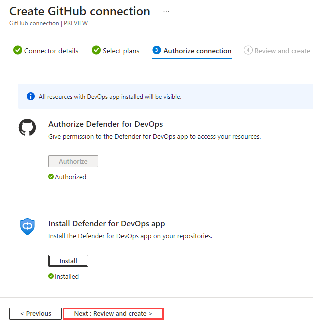

# Module 4 – Integrating Defender for DevOps with GitHub Advanced Security

## Objectives
In this exercise, you will learn how to configure GitHub Connector in Defender for DevOps.

### Exercise 1: Connecting your GitHub organization

1.	In [Azure Portal](http://portal.azure.com/), search for **Microsoft Defender for Cloud (1)** and then click on it from the search results **(2)**. 

    

2.	In the left navigation pane, click **Environment settings (1)**, click the **Add environment (2)** button and click **GitHub (preview) (3)**. 

    

3. In **Create GitHub connection** page, enter the **Name** for the connector as `CNAPP-git` **(1)**, select your **Subscription (2)**, select **asclab (3)** **Resource Group** and select any **Region (4)**.	Click **Next:select plans > (5)** button to continue.

    

4. In the next page leave the default selection with **DevOps** selected and click **Next: Authorize connection >** button to continue. 

    

5.	Click **Authorize** button. If you get an authorization pop-up click **Authorize Microsoft SecurityDevOps**.

    

    

6.	Now Click **Install** button under **Install Defender for DevOps app**. If this is the first time you’re authorizing your DevOps connection, you’ll receive a pop-up screen, that will ask you confirmation of which repository you'd like to install the app. Select your **Github repository**. 

    

    

7. Choose **All repositories (1)** and click on **Install (2)**

    

8. Back in the **Azure portal**, you’ll notice that the extension is installed, click on **Review and Create** button to continue.  

    

9. Click **Create**.

    

11. Navigating to the **Environment Settings** under **Microsoft Defender for Cloud**, you’ll notice the GitHub Connection was successfully created. 

    

### Exercise 2: Configure the Microsoft Security DevOps GitHub action

To setup GitHub action:
1.	Login to the GitHub repo that you created in Exercise 4.
2.	Select a repository on which you want to configure the GitHub action.
3.	Select **Actions** as shown in the image below 

4.	Select **New Workflow**

5.	In the text box, enter a name for your workflow file. For example **msdevopssec.yml**

6.	Copy and paste the following sample action workflow into the **Edit new file** tab. 

~~~~~~
name: MSDO IaC Scan

on:
  # Triggers the workflow on push or pull request events but only for the main branch
  push:
    branches: [ main ]
    
  pull_request:
    branches: [ main ]

  workflow_dispatch:

jobs:
  security:
    runs-on: windows-latest
    continue-on-error: false
    strategy:
      fail-fast: true
      
    steps:
    - uses: actions/checkout@v3
    
    - uses: actions/setup-dotnet@v3
      with:
        dotnet-version: |
          5.0.x
          6.0.x
          
    - name: Run Microsoft Security DevOps
      uses: microsoft/security-devops-action@preview
      continue-on-error: false
      id: msdo
      with:
        categories: 'IaC'

    - name: Upload alerts to Security tab
      uses: github/codeql-action/upload-sarif@v2
      with:
        sarif_file: ${{ steps.msdo.outputs.sarifFile }}
~~~~~~~

7.	Click on **Start Commit** **Commit new file**

The process can take up to one minute to complete. 
A workflow gets created in your repositories github folder with the above copied yml file 

8.	Select **Actions** and verify the new action is running/completed running. 

9.	Once this job completes running, navigate to the Security tab > Click on Code scanning 

NOTE: if you don’t see anything is because your code scanning feature is disabled in GitHub. Refer to the prerequisites section of this lab to review the instructions to enable. 

10.	If you see No code scanning alerts here, In the filter of Code scanning tab, choose is:open tool: Notice the available tools Defender for DevOps uses.

11.	Code scanning findings will be filtered by specific MSDO tools in GitHub. These code scanning results are also pulled into Defender for Cloud recommendations.

