# Module 5:  Integrating Defender for DevOps with GitHub Advanced Security

## Objectives
In this exercise, you will learn how to configure GitHub Connector in Defender for DevOps.

### Exercise 1: Connecting your GitHub organization

1. Navigate to GitHub tab.

1. Go to repository **Settings (1)**, under **Actions (2)** select **General (3)** and set the **Workflow Permissions** to **Read and write permissions (4)** then click **Save (5)**.

      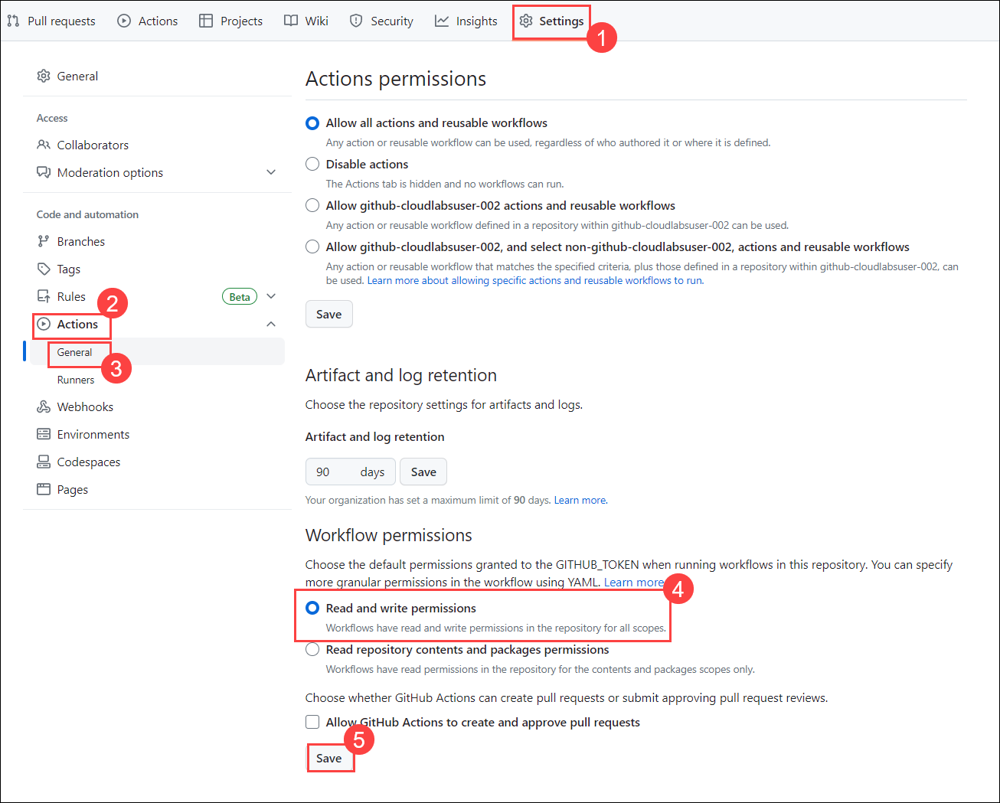

2.	Go to [Azure Portal](http://portal.azure.com/), search for **Microsoft Defender for Cloud (1)** and then click on it from the search results **(2)**. 

      

3.	In the left navigation pane, click **Environment settings (1)**, click the **Add environment (2)** button and click **GitHub (preview) (3)**. 

      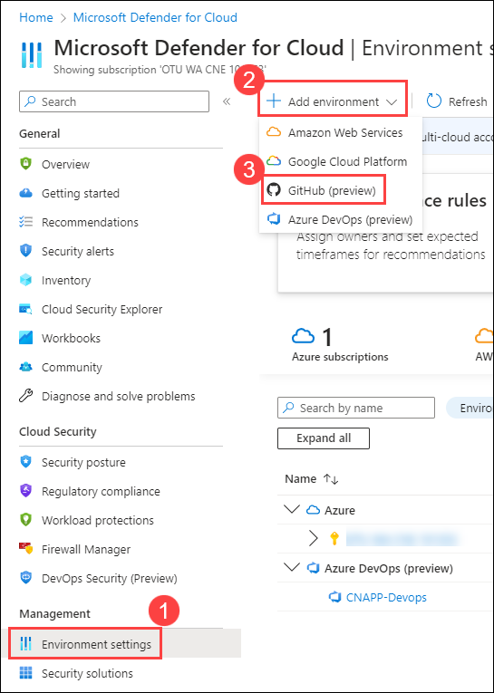

4. In **Create GitHub connection** page, enter the **Name** for the connector as `CNAPP-git` **(1)**, select your **Subscription (2)**, select **asclab (3)** **Resource Group** and select any **Region (4)**.	Click **Next: select plans > (5)** button to continue.

      

5. In the next page leave the default selection with **DevOps** selected and click **Next: Authorize connection >** button to continue. 

      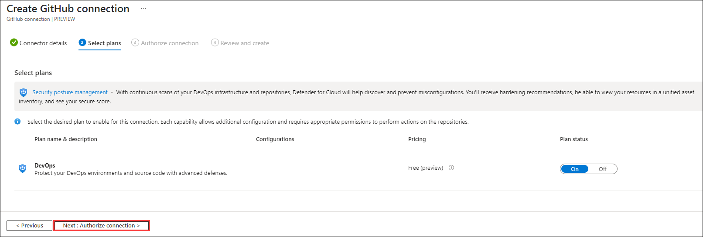

6. Click **Authorize** button. If you get an authorization pop-up click **Authorize Microsoft SecurityDevOps**.

      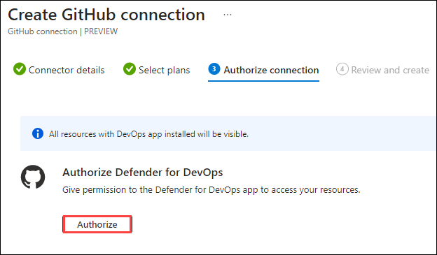

      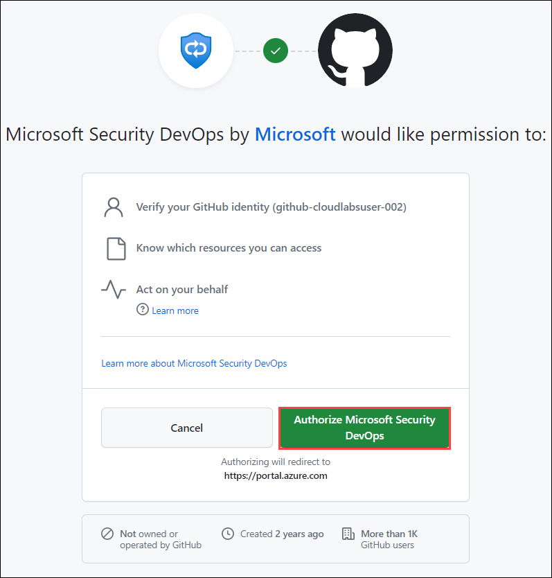

7. Now click **Install** button under **Install Defender for DevOps app**. If this is the first time you’re authorizing your DevOps connection, you’ll receive a pop-up screen, that will ask you confirmation of which repository you'd like to install the app. Select your **GitHub repository**. 

      
  
      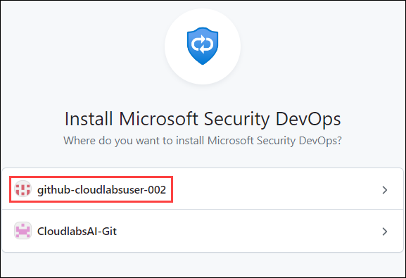

8. Choose **All repositories (1)** and click on **Install (2)**

      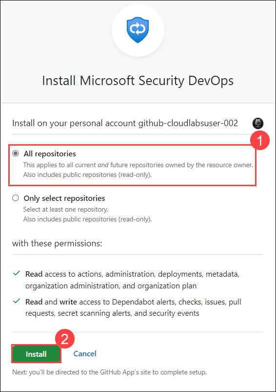

9. Back in the **Azure portal**, you’ll notice that the extension is installed, click on **Review and Create** button to continue.  

      

10. Click **Create**.

      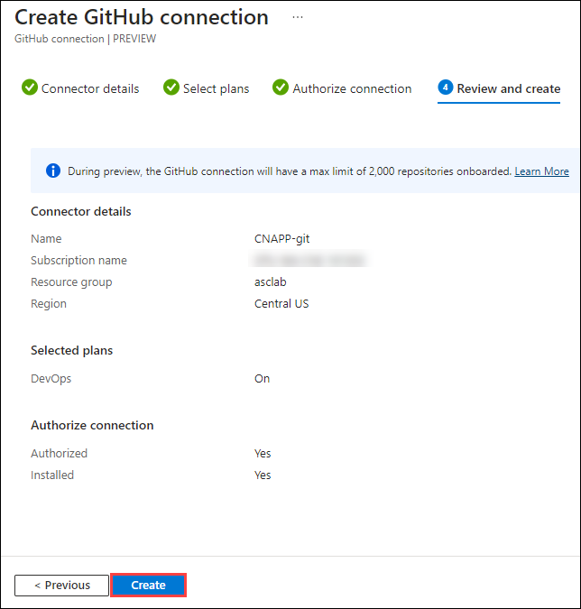

11. Navigating to the **Environment Settings** under **Microsoft Defender for Cloud**, you’ll notice the ***GitHub*** Connection was successfully created. 

      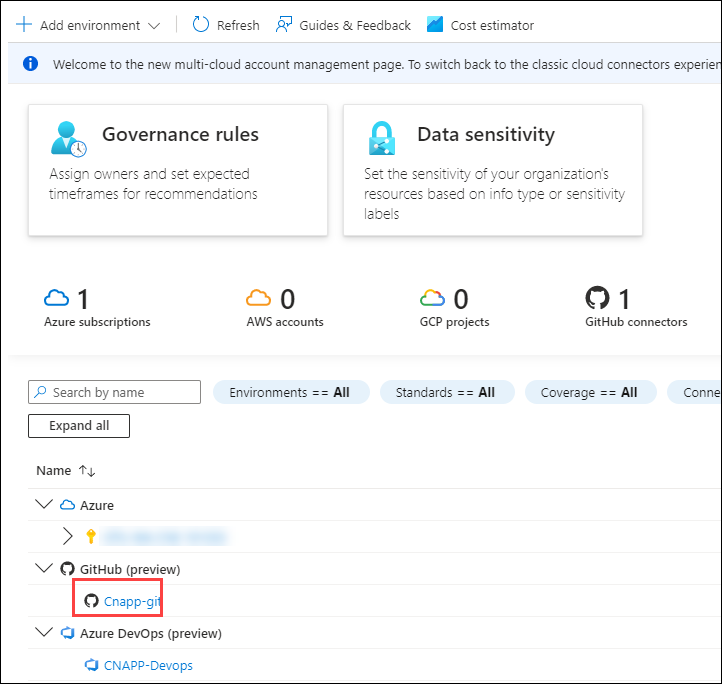

### Exercise 2: Configure the Microsoft Security DevOps GitHub action

1. Navigate back to **GitHub**, from **Microsoft-Defender-for-Cloud** repository, click on **Actions (1)** and **I understand my workflows, go ahead and enable them (2)**.

      

2.	Click on **New workflow**.

      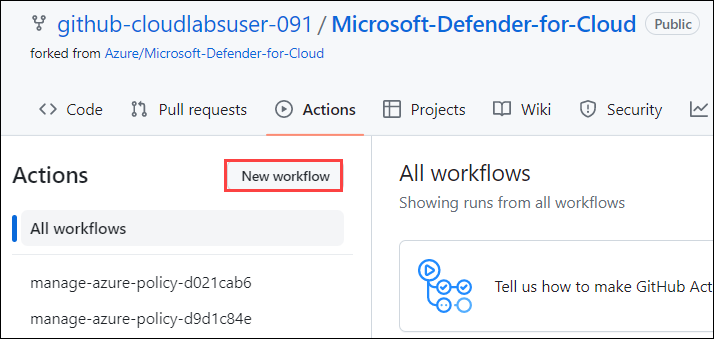

3.	Next, for **Choose a workflow** click on **set up a workflow yourself**.  

      

4. Enter the name for your workflow file as **msdevopssec.yml (1)**. Then copy and paste the following sample action workflow into the **Edit new file (2)** tab. 

    ~~~~~~
    name: MSDO IaC Scan

    on:
      # Triggers the workflow on push or pull request events but only for the main branch
      push:
        branches: [ main ]

      pull_request:
        branches: [ main ]

      workflow_dispatch:

    jobs:
      security:
        runs-on: windows-latest
        continue-on-error: false
        strategy:
          fail-fast: true

        steps:
        - uses: actions/checkout@v3

        - uses: actions/setup-dotnet@v3
          with:
            dotnet-version: |
              5.0.x
              6.0.x

        - name: Run Microsoft Security DevOps
          uses: microsoft/security-devops-action@preview
          continue-on-error: false
          id: msdo
          with:
            categories: 'IaC'

        - name: Upload alerts to Security tab
          uses: github/codeql-action/upload-sarif@v2
          with:
            sarif_file: ${{ steps.msdo.outputs.sarifFile }}
    ~~~~~~~

   
      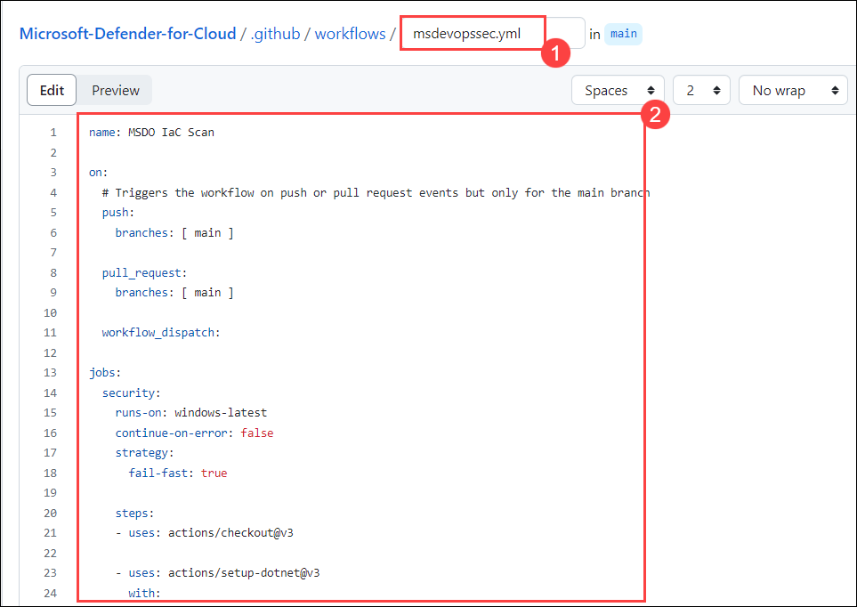

5.	Click on **Commit Changes** and click **Commit Changes** again. 

      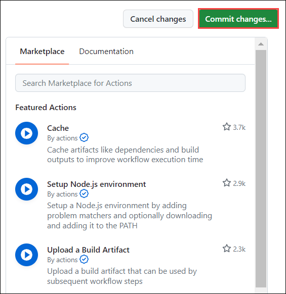

      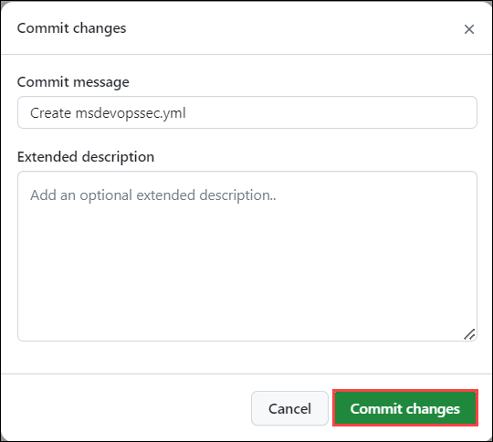

6. The process can take up to one minute to complete. A workflow gets created in your repositories GitHub folder with the above copied yml file. Select **Actions** and wait for it to complete running. 

      

7.	Once this job completes running, navigate to the **Security (1)** tab and click on **Code scanning (2)**. Code scanning findings will be filtered by specific MSDO tools in GitHub.

      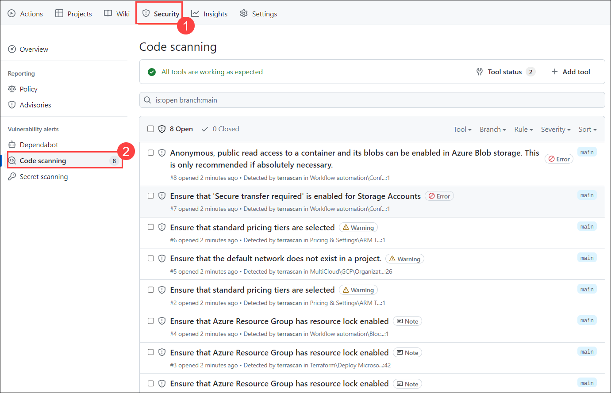

